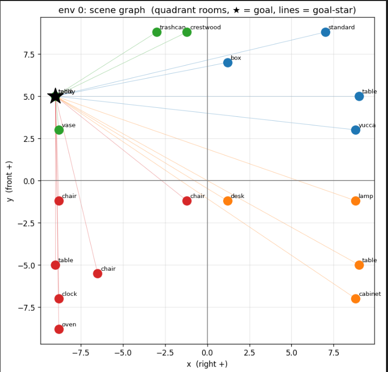
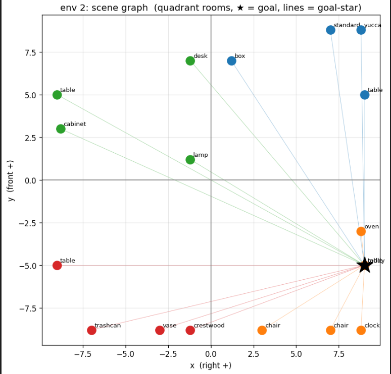

**Contents**

- [Hierarchical Non-Metric Graph — Representation & Encoding (DDQN pipeline)](#hierarchical-non-metric-graph--representation--encoding-ddqn-pipeline)
  - [1. The idea](#1-the-idea)
  - [2. Input (unchanged — the env observation)](#2-input-unchanged--the-env-observation)
  - [3. Graph structure (hierarchical)](#3-graph-structure-hierarchical)
  - [4. Deriving the categories from `x,y` (then discarding `x,y`)](#4-deriving-the-categories-from-xy-then-discarding-xy)
    - [4.1 Room membership (quadrant)](#41-room-membership-quadrant)
    - [4.2 Qualitative direction (3-way per axis, threshold = 0.4 m)](#42-qualitative-direction-3-way-per-axis-threshold--04-m)
  - [5. Node encoding](#5-node-encoding)
  - [6. Edge encoding](#6-edge-encoding)
  - [7. Message passing & readout](#7-message-passing--readout)
  - [8. Metric vs non-metric (across the two configs)](#8-metric-vs-non-metric-across-the-two-configs)
  - [9. How to run (train)](#9-how-to-run-train)
  - [10. Comparison methodology & the open caveat](#10-comparison-methodology--the-open-caveat)
  - [11. What was deliberately excluded](#11-what-was-deliberately-excluded)
- [Non-metric graph example](#non-metric-graph-example)
- [Results — Metric vs Hierarchical Non-Metric Graph (DDQN pipeline)](#results--metric-vs-hierarchical-non-metric-graph-ddqn-pipeline)
  - [Comparison  (values: `final (best/min)`)](#comparison--values-final-bestmin)
  - [Reading (with the caveat above)](#reading-with-the-caveat-above)
  - [Run provenance](#run-provenance)

---


# Hierarchical Non-Metric Graph — Representation & Encoding (DDQN pipeline)

This documents the **hierarchical non-metric** graph encoder as built for the **DDQN
config pipeline** — what the graph is and exactly how it's encoded. It reflects
[scripts/algos/perception/hierarchical_graph_encoder.py](scripts/algos/perception/hierarchical_graph_encoder.py)
(`HierarchicalGraphEncoder`).

- Encoder: [scripts/algos/perception/hierarchical_graph_encoder.py](scripts/algos/perception/hierarchical_graph_encoder.py)
- Selected by config: `scripts/algos/configs/metric_vs_nonmetric/hierarchical.json`
- Metric baseline it's compared against: `perception/graph_encoder.py` (`GraphEncoder`, `include_node_metric: true`) — config `metric.json`
- Runs through: [scripts/algos/run_experiments.py](scripts/algos/run_experiments.py) → `runners/train_ddqn.py` (task `Aloha_nav_hab_wr`)

> Everything (metric baseline + hierarchical non-metric, train and eval) goes through the
> DDQN pipeline. The earlier proposal is in [non_metric_graph.md](non_metric_graph.md).

---

## 1. The idea

The metric graph puts **continuous object coordinates** `x,y,z` directly in node
features (and the perception metric encoder also puts a **distance** category on edges).
The hierarchical non-metric graph removes **all** continuous geometry **and** distance,
replacing them with **qualitative, categorical relations**:

- a **room hierarchy** (which scene quadrant each object is in), and
- **qualitative direction** between objects (left/right, front/behind) — **no distance, no coordinates.**

**Key construction rule:** raw `x,y` are read **only to derive the categories** at build
time (room id, direction sign), then **dropped**. The GNN sees no coordinates and no
distances — in nodes *or* edges.

---

## 2. Input (unchanged — the env observation)

Per object (currently **M = 23**, the 4-room scene):
```
[object_id, active, is_goal, x, y, z]   →   graph_flat[B, 6·M]
```
The encoder builds the whole graph **inside `forward(graph_flat)`** and returns a
`[B, 128]` embedding — a drop-in for the perception `GraphEncoder`.

---

## 3. Graph structure (hierarchical)

**Nodes** (per env): `M = 23` object nodes + `R = 4` room nodes = **27 nodes**.
No scene node, no robot node.

**Edges** (bidirectional, typed):
```
   goal object  <──>  every object   (goal-star, direction-labelled)
   object       <──>  its room       (containment)
   room         <──>  room           (all ordered pairs, direction-labelled)
   every node   <──>  itself         (self-loop)
```

```text
        room_R/F   room_L/F   room_R/B   room_L/B      (4 quadrant rooms)
           |  \______|_________|________/  |
           |            (room–room)        |
        [objects in room]           [objects in room]
           \___ containment ___/
        goal ●───────────────────────────────● objects   (goal-star, dir-labelled)
```

> This hierarchy (object → room) is what makes the encoder **hierarchical**. The stock
> perception encoder (`metric.json` baseline) is **flat** — object nodes only, no room nodes.

---

## 4. Deriving the categories from `x,y` (then discarding `x,y`)

### 4.1 Room membership (quadrant)
```
room_id = (x < 0) + 2·(y < 0)      # 0..3
  0: x≥0, y≥0  → right / front (R/F)
  1: x<0, y≥0  → left  / front (L/F)
  2: x≥0, y<0  → right / back  (R/B)
  3: x<0, y<0  → left  / back  (L/B)
```
Each room node carries `x_zone` (right/left, one-hot) and `y_zone` (front/back, one-hot).

### 4.2 Qualitative direction (3-way per axis, threshold = 0.4 m)
For a pair `i → j` with `Δx = x_j − x_i`, `Δy = y_j − y_i`:
```
x_direction:  NEG (left)   if Δx < −0.4   / ALIGNED if |Δx| ≤ 0.4 / POS (right) if Δx > 0.4
y_direction:  NEG (behind)                / ALIGNED               / POS (front)   (same rule on Δy)
```
Only the **sign** (bucketed at 0.4 m) is kept — magnitude is thrown away.

---

## 5. Node encoding

**Object node** → `object_mlp`:
```
[ name_proj(CLIP_name[object_id]) (16) ,  active (1) ,  is_goal (1) ]   → MLP → 128
        (+ pos_proj(x,y,z) (16)  ONLY if include_node_metric=True)
```
`object_id` indexes the precomputed `id_to_name_emb` table in `text_embeddings.pt`
(no CLIP model runs at train time). No color embedding.

**Room node** → `room_mlp`:
```
[ is_goal_room (1) ,  x_zone one-hot (2) ,  y_zone one-hot (2) ]        → MLP → 128
```
No `is_current_room` (that would make the graph robot-dependent / dynamic).

---

## 6. Edge encoding

Every edge stores **four categorical fields**, each a learned embedding:

| field | values | vocab | emb dim |
|---|---|---|---|
| `relation_type` | `SELF, GOAL_STAR, OBJ_IN_ROOM, ROOM_HAS_OBJ, ROOM_ROOM` | 5 | 8 |
| `x_direction` | `NONE, NEG(left), ALIGNED, POS(right)` | 4 | 4 |
| `y_direction` | `NONE, NEG(behind), ALIGNED, POS(front)` | 4 | 4 |
| `room_relation` | `NONE, SAME_ROOM, DIFFERENT_ROOM` | 3 | 4 |

→ concatenated **`edge_dim = 20`**, fed to `GATv2Conv(edge_dim=20)`. **No distance field.**

| edge | relation_type | x/y_direction | room_relation |
|---|---|---|---|
| self-loop | `SELF` | `NONE` | `NONE` |
| goal → object | `GOAL_STAR` | sign(obj − goal) | `SAME`/`DIFFERENT` room vs goal |
| object → goal | `GOAL_STAR` | sign(goal − obj) *(reverse)* | same as above |
| object → room | `OBJ_IN_ROOM` | `NONE` | `SAME` |
| room → object | `ROOM_HAS_OBJ` | `NONE` | `SAME` |
| room → room | `ROOM_ROOM` | quadrant geometry (static) | `DIFFERENT` |

---

## 7. Message passing & readout

- **3 × edge-aware GATv2 layers**, hidden 128, 4 heads (`edge_dim=20`), residual + ReLU-dropout + LayerNorm:
  `h ← LayerNorm(h + dropout(relu(GATv2(h, edge_index, edge_attr))))`.
- **Goal-centric readout:**
  ```
  z = [ h_goal ,  h_goal_room ,  h_global ]        # 3 × 128 = 384
  graph_emb = readout(z)                            # 384 → 256 → 128
  ```
  `h_goal` = goal object node · `h_goal_room` = room node containing the goal · `h_global` = mean over all 27 nodes.

The 128-d `graph_emb` feeds the DDQN Q-network + the `OrientationFeature` module.

---

## 8. Metric vs non-metric (across the two configs)

The study compares two encoders in the **same DDQN pipeline**, both output 128-d:

| config | encoder | node coords | edges |
|---|---|---|---|
| **`metric.json`** (baseline) | `perception.GraphEncoder`, `include_node_metric: true` | `x,y,z` in nodes | direction **+ distance** categories (flat, no room nodes) |
| **`hierarchical.json`** (this doc) | `perception.HierarchicalGraphEncoder`, `include_node_metric: false` | **none** | **direction only** (hierarchical, room nodes) |

The hierarchical encoder also accepts `include_node_metric: true` (re-adds `pos_proj(xyz)` to
object nodes) if you want a metric-hierarchical variant.

> The metric baseline's edges still carry a **distance** one-hot (coarse metric). The
> hierarchical non-metric encoder has **no metric anywhere** — nodes or edges.

---

## 9. How to run (train)

```bash
cd /home/rizo/work/GIROL
PYTHONNOUSERSITE=1 ./isaaclab.sh -p scripts/algos/run_experiments.py \
  --configs-dir scripts/algos/configs/metric_vs_nonmetric
```
Runs both experiments (they sort alphabetically): `hierarchical` then `metric`. Run one with
`--start/--end` (0 = hierarchical, 1 = metric). Logs/checkpoints:
`logs/skrl/Aloha_nav_hab_wr/<timestamp>_metric_vs_nonmetric/{hierarchical,metric}/`.

**Eval:** run the resolved config through the runner with eval on:
```bash
./isaaclab.sh -p scripts/algos/runners/train_ddqn.py --config <resolved.json> --eval 1 --checkpoint <agent.pt>
```

**TensorBoard:** `tensorboard --logdir logs/skrl/Aloha_nav_hab_wr` — overlay `orientation/acc10/20/30`
for the two runs.

---

## 10. Comparison methodology & the open caveat

The comparison is **metric (`perception.GraphEncoder`, metric on)** vs **hierarchical
non-metric (`HierarchicalGraphEncoder`)**, both in the DDQN pipeline on the same 4-room scene.

⚠️ **Caveat from the earlier SAC experiments:** metric and non-metric tracked each other
almost exactly — which is equally consistent with *the graph being ignored and the image
doing the work*. The decisive control is an **img-only** run (graph contribution zeroed):
- img-only ≪ metric → the graph genuinely contributes; non-metric preserving it is a real result.
- img-only ≈ metric → the graph is ignored; the comparison is moot.

Establish the img-only point before claiming "non-metric = metric."

---

## 11. What was deliberately excluded

- **No scene node**; **no robot node / no `is_current_room`** (keeps the graph static per episode).
- **No distance/gap bins** — direction-only, strictly non-metric.
- **Goal-only star** (no separate "active object" hub).
- **One scene layout** (4 rooms) — no room-index permutation / semantic room classes.


# Non-metric graph example

```
=== env 0: 23 objects | goal = #22 teddy in room L/F ===
    room occupancy (active objs): {'R/F': 4, 'L/F': 5, 'R/B': 4, 'L/B': 6}   -> 4/4 rooms populated
 # name         act gl       x       y room | dir vs goal (x, y, room)
 0 table          1  0   -9.00   -5.00  L/B | align, back , diff
 1 table          1  0    9.00    5.00  R/F | right, align, diff
 2 table          1  0   -9.00    5.00  L/F | align, align, same
 3 table          1  0    9.00   -5.00  R/B | right, back , diff
 4 box            1  0    1.20    7.00  R/F | right, front, diff
 5 oven           1  0   -8.80   -8.80  L/B | align, back , diff
 6 desk           1  0    1.20   -1.20  R/B | right, back , diff
 7 chair          1  0   -8.80   -1.20  L/B | align, back , diff
 8 chair          1  0   -1.20   -1.20  L/B | right, back , diff
 9 chair          0  0    0.50   -1.00  R/B | right, back , diff
10 chair          0  0    1.00   -1.00  R/B | right, back , diff
11 chair          1  0   -6.50   -5.50  L/B | right, back , diff
12 chair          0  0    2.00   -1.00  R/B | right, back , diff
13 cabinet        1  0    8.80   -7.00  R/B | right, back , diff
14 trashcan       1  0   -3.00    8.80  L/F | right, front, same
15 vase           1  0   -8.80    3.00  L/F | align, back , same
16 clock          1  0   -8.80   -7.00  L/B | align, back , diff
17 crestwood      1  0   -1.20    8.80  L/F | right, front, same
18 ladder         0  0   -3.00   -0.50  L/B | right, back , diff
19 lamp           1  0    8.80   -1.20  R/B | right, back , diff
20 standard       1  0    7.00    8.80  R/F | right, front, diff
21 yucca          1  0    8.80    3.00  R/F | right, back , diff
22 teddy          1  1   -9.00    5.00  L/F | (goal)

SCENE  env 0  (23 objects, goal = teddy)
├── Room R/F  [4 obj]
│   ├──   table        (  9.00,   5.00)
│   ├──   box          (  1.20,   7.00)
│   ├──   standard     (  7.00,   8.80)
│   └──   yucca        (  8.80,   3.00)
├── Room L/F  [5 obj]   <-- GOAL ROOM
│   ├──   table        ( -9.00,   5.00)
│   ├──   trashcan     ( -3.00,   8.80)
│   ├──   vase         ( -8.80,   3.00)
│   ├──   crestwood    ( -1.20,   8.80)
│   └── * teddy        ( -9.00,   5.00) [GOAL]
├── Room R/B  [4 obj]
│   ├──   table        (  9.00,  -5.00)
│   ├──   desk         (  1.20,  -1.20)
│   ├──   cabinet      (  8.80,  -7.00)
│   └──   lamp         (  8.80,  -1.20)
└── Room L/B  [6 obj]
    ├──   table        ( -9.00,  -5.00)
    ├──   oven         ( -8.80,  -8.80)
    ├──   chair        ( -8.80,  -1.20)
    ├──   chair        ( -1.20,  -1.20)
    ├──   chair        ( -6.50,  -5.50)
    └──   clock        ( -8.80,  -7.00)
```


```
=== env 2: 23 objects | goal = #22 teddy in room R/B ===
    room occupancy (active objs): {'R/F': 4, 'L/F': 4, 'R/B': 6, 'L/B': 4}   -> 4/4 rooms populated
 # name         act gl       x       y room | dir vs goal (x, y, room)
 0 table          1  0   -9.00    5.00  L/F | left , front, diff
 1 table          1  0    9.00   -5.00  R/B | align, align, same
 2 table          1  0    9.00    5.00  R/F | align, front, diff
 3 table          1  0   -9.00   -5.00  L/B | left , align, diff
 4 box            1  0    1.20    7.00  R/F | left , front, diff
 5 oven           1  0    8.80   -3.00  R/B | align, front, same
 6 desk           1  0   -1.20    7.00  L/F | left , front, diff
 7 chair          1  0    7.00   -8.80  R/B | left , back , same
 8 chair          1  0    3.00   -8.80  R/B | left , back , same
 9 chair          0  0    0.50   -1.00  R/B | left , front, same
10 chair          0  0    1.00   -1.00  R/B | left , front, same
11 chair          0  0    1.50   -1.00  R/B | left , front, same
12 chair          0  0    2.00   -1.00  R/B | left , front, same
13 cabinet        1  0   -8.80    3.00  L/F | left , front, diff
14 trashcan       1  0   -7.00   -8.80  L/B | left , back , diff
15 vase           1  0   -3.00   -8.80  L/B | left , back , diff
16 clock          1  0    8.80   -8.80  R/B | align, back , same
17 crestwood      1  0   -1.20   -8.80  L/B | left , back , diff
18 ladder         0  0   -3.00   -0.50  L/B | left , front, diff
19 lamp           1  0   -1.20    1.20  L/F | left , front, diff
20 standard       1  0    7.00    8.80  R/F | left , front, diff
21 yucca          1  0    8.80    8.80  R/F | align, front, diff
22 teddy          1  1    9.00   -5.00  R/B | (goal)

SCENE  env 2  (23 objects, goal = teddy)
├── Room R/F  [4 obj]
│   ├──   table        (  9.00,   5.00)
│   ├──   box          (  1.20,   7.00)
│   ├──   standard     (  7.00,   8.80)
│   └──   yucca        (  8.80,   8.80)
├── Room L/F  [4 obj]
│   ├──   table        ( -9.00,   5.00)
│   ├──   desk         ( -1.20,   7.00)
│   ├──   cabinet      ( -8.80,   3.00)
│   └──   lamp         ( -1.20,   1.20)
├── Room R/B  [6 obj]   <-- GOAL ROOM
│   ├──   table        (  9.00,  -5.00)
│   ├──   oven         (  8.80,  -3.00)
│   ├──   chair        (  7.00,  -8.80)
│   ├──   chair        (  3.00,  -8.80)
│   ├──   clock        (  8.80,  -8.80)
│   └── * teddy        (  9.00,  -5.00) [GOAL]
└── Room L/B  [4 obj]
    ├──   table        ( -9.00,  -5.00)
    ├──   trashcan     ( -7.00,  -8.80)
    ├──   vase         ( -3.00,  -8.80)
    └──   crestwood    ( -1.20,  -8.80)
```

# Results — Metric vs Hierarchical Non-Metric Graph (DDQN pipeline)

Comparison of the two graph representations trained through the **DDQN** pipeline
(`run_experiments.py`, task `Aloha_nav_hab_wr`, **4-room** scene). Same everything
except the graph encoder.
- **metric** — `perception.GraphEncoder`, `include_node_metric: true` (coords in nodes, direction **+ distance** edges, flat)
- **non-metric (hierarchical)** — `perception.HierarchicalGraphEncoder`, `include_node_metric: false` (no coords, **direction-only** edges, object+room hierarchy)

Metric definitions (aux orientation head, 36 bins = 10°/bin):
`acc_strict` = exact bin (≈ within 10°) · `acc_relaxed` = ±1 bin (≈ within 20°) · `mean_error_deg` = mean |heading error| (lower better).

---

## Comparison  (values: `final (best/min)`)

| metric | **metric baseline** | **non-metric (hierarchical)** | winner |
|---|---|---|---|
| orientation **acc_strict** (≈≤10°) | 0.700 (0.708) | **0.790 (0.826)** | non-metric |
| orientation **acc_relaxed** (≈≤20°) | 0.751 (0.760) | **0.816 (0.854)** | non-metric |
| orientation **mean_error_deg** ↓ | 22.1° (21.8°) | **15.9° (13.2°)** | non-metric |
| orientation confidence | 0.567 | **0.668** | non-metric |
| nav success_rate (%) | **81.7 (90.8)** | 63.0 (81.0) | metric |
| avg_episode_length | 33.4 | 52.4 | — |
| curriculum stage reached | 4 | 4 | tie |
| Q-network loss ↓ | 0.31 (0.17) | 0.31 (0.15) | tie |
| total reward (mean) | 3.33 (7.0) | 5.80 (7.45) | — |
| **num_envs** | **24** | **10** | ⚠ differ |
| **training steps** | **249,750** | **178,400** | ⚠ differ |
---

## Reading (with the caveat above)
- **Orientation:** the hierarchical **non-metric graph beats the metric graph** — `acc_strict` 0.79 vs 0.70,
  mean error ~16° vs ~22° — and does so with fewer envs/steps. Qualitative direction + room hierarchy appears
  *at least as informative* as raw coordinates + distance for heading prediction.
- **Navigation:** metric shows higher success (81.7% vs 63%), but that's the run with 3× the data — treat as inconclusive.

---

## Run provenance
| | metric | non-metric (hierarchical) |
|---|---|---|
| run dir | `logs/skrl/Aloha_nav_hab_wr/07.21_20-50-59_metric_vs_nonmetric/metric/` | `logs/skrl/Aloha_nav_hab_wr/07.21_15-16-25_metric_vs_nonmetric/hierarchical/` |
| encoder | `perception.GraphEncoder` (metric, flat) | `perception.HierarchicalGraphEncoder` (non-metric, hierarchical) |
| num_envs / steps | 24 / 249,750 | 10 / 178,400 |
| seed | 42 | 42 |

Extract command (for re-reads): read `.../{run}/tensorboard/` scalars
(`aux/orient/acc_strict`, `aux/orient/acc_relaxed`, `aux/orient/mean_error_deg`, `env/success_rate`).
